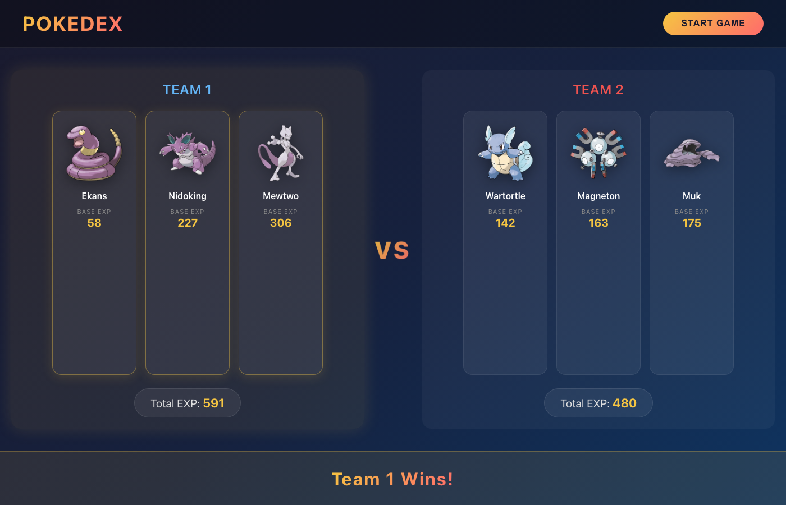

# Pokedex Game React


A Pokémon Team Battle Simulator built with React and Vite.  
Two random teams of 3 Pokémon are generated, their total base EXP is compared, and a winner is declared!

---

## 🔗 Live Demo

👉 **[View Live on Vercel](https://pokedox-game-react-pearl.vercel.app)**

---

## 🖼 Screenshot



---

## ⚡ Features

- Fetches random Pokémon from [PokeAPI](https://pokeapi.co/)
- Two teams of 3 Pokémon battle by total Base EXP
- Official artwork for each Pokémon
- Winner team highlighted with golden glow
- Responsive design (mobile & desktop)
- "Start Game" reloads with new random teams

---

## 🛠 Tech Stack

- **React 19** — UI components & state management
- **Vite 8** — Fast dev server & bundling
- **PokeAPI** — Pokémon data source
- **CSS3** — Custom styling with gradients & animations

---

## 💻 How to Run Locally

```bash
# Clone the repository
git clone https://github.com/asafsafarli/pokedex-game-AI.git

# Enter the project directory
cd pokedex-app

# Install dependencies
npm install

# Start development server
npm run dev
```
